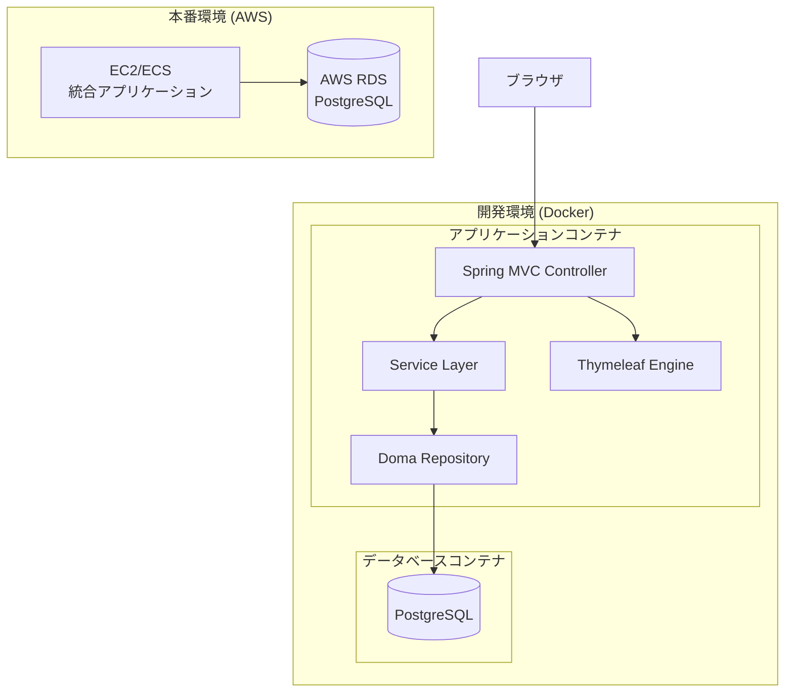

# 設計書

## 概要

本設計書は、Thymeleafを使用したSpring Boot開発環境をDockerコンテナ内で構築するための詳細な設計を定義します。開発環境は3つのコンテナ（アプリケーション、データベース）で構成され、既存のThymeleaf HTMLファイルを活用しながらバックエンドのビジネスロジックを実行・検証できる環境を提供します。

本番環境では、フロントエンドとバックエンドを単一のSpring Bootアプリケーションとして統合し、AWS上にデプロイする想定です。

## アーキテクチャ

### システム構成図



### アーキテクチャの特徴

1. **開発環境**: フロントエンドとバックエンドを単一のSpring Bootアプリケーションとして実装し、Dockerコンテナで実行
2. **レイヤー分離**: プレゼンテーション層（Controller + Thymeleaf）、ビジネスロジック層（Service）、データアクセス層（Repository）の3層アーキテクチャ
3. **本番環境互換性**: 開発環境と本番環境で同じアプリケーション構成を使用し、データベース接続のみ環境変数で切り替え

## コンポーネントとインターフェース

### 1. アプリケーションコンテナ

**責務**: Spring Bootアプリケーションの実行、HTTPリクエストの処理、Thymeleafテンプレートのレンダリング

**技術スタック**:
- Java 25（利用不可能な場合はJava 21または最新LTS）
- Spring Boot 4.0.0（利用不可能な場合は3.x系の最新版）
- Thymeleaf 3.x
- Doma 3.x
- Lombok
- SLF4J + Logback

**主要コンポーネント**:

#### Controller層
```java
@Controller
public class SampleController {
    private final SampleService sampleService;
    
    @GetMapping("/")
    public String index(Model model) {
        // ビジネスロジックの呼び出し
        // モデルへのデータ設定
        // Thymeleafテンプレート名を返却
    }
}
```

#### Service層
```java
@Service
public class SampleService {
    private final SampleRepository sampleRepository;
    
    @Transactional
    public SampleEntity processBusinessLogic() {
        // ビジネスロジックの実装
        // リポジトリを使用したデータアクセス
    }
}
```

#### Repository層（Doma）
```java
@Dao
public interface SampleRepository {
    @Select
    List<SampleEntity> findAll();
    
    @Insert
    int insert(SampleEntity entity);
}
```

### 2. データベースコンテナ

**責務**: PostgreSQLデータベースの提供、データの永続化

**技術スタック**:
- PostgreSQL 16.x（最新安定版）

**設定**:
- データベース名: `appdb`
- ユーザー名: `appuser`
- パスワード: 環境変数で設定
- ポート: 5432（コンテナ内部）

### 3. ビルドシステム（Gradle）

**責務**: プロジェクトのビルド、依存関係管理、品質管理ツールの実行

**主要タスク**:
- `build`: アプリケーションのビルド
- `test`: ユニットテストの実行
- `checkstyleMain`: CheckStyleによるコーディング規約チェック
- `jacocoTestReport`: JaCoCoによるカバレッジレポート生成
- `spotbugsMain`: SpotBugsによる静的解析
- `bootRun`: Spring Bootアプリケーションの起動

## データモデル

### エンティティ設計

Domaを使用したエンティティの基本構造：

```java
@Entity
@Table(name = "sample_table")
public class SampleEntity {
    @Id
    @GeneratedValue(strategy = GenerationType.IDENTITY)
    private Long id;
    
    @Column(name = "name")
    private String name;
    
    @Column(name = "created_at")
    private LocalDateTime createdAt;
    
    @Column(name = "updated_at")
    private LocalDateTime updatedAt;
}
```

### データベーススキーマ

初期化スクリプト（`init.sql`）で以下を定義：

```sql
CREATE TABLE IF NOT EXISTS sample_table (
    id BIGSERIAL PRIMARY KEY,
    name VARCHAR(255) NOT NULL,
    created_at TIMESTAMP NOT NULL DEFAULT CURRENT_TIMESTAMP,
    updated_at TIMESTAMP NOT NULL DEFAULT CURRENT_TIMESTAMP
);
```

## 設定管理

### アプリケーション設定

Spring Bootの設定ファイル構造：

```
src/main/resources/
├── application.yml              # 共通設定
├── application-dev.yml          # 開発環境設定
├── application-prod.yml         # 本番環境設定
├── logback-spring.xml          # ログ設定
└── templates/                   # Thymeleafテンプレート
    └── *.html
```

#### application.yml（共通設定）
```yaml
spring:
  application:
    name: spring-boot-thymeleaf-app
  thymeleaf:
    cache: false
    prefix: classpath:/templates/
    suffix: .html
    mode: HTML
```

#### application-dev.yml（開発環境）
```yaml
spring:
  datasource:
    url: jdbc:postgresql://postgres:5432/appdb
    username: appuser
    password: ${DB_PASSWORD:devpassword}
    driver-class-name: org.postgresql.Driver
  jpa:
    show-sql: true
    
logging:
  level:
    root: INFO
    com.example: DEBUG
```

#### application-prod.yml（本番環境）
```yaml
spring:
  datasource:
    url: ${DATABASE_URL}
    username: ${DB_USERNAME}
    password: ${DB_PASSWORD}
    driver-class-name: org.postgresql.Driver
  thymeleaf:
    cache: true
    
logging:
  level:
    root: WARN
    com.example: INFO
```

### Docker設定

#### docker-compose.yml（開発環境）
```yaml
version: '3.8'

services:
  app:
    build:
      context: .
      dockerfile: Dockerfile.dev
    ports:
      - "8080:8080"
    environment:
      - SPRING_PROFILES_ACTIVE=dev
      - DB_PASSWORD=devpassword
    volumes:
      - ./src:/app/src
      - gradle-cache:/root/.gradle
    depends_on:
      - postgres
    networks:
      - app-network

  postgres:
    image: postgres:16
    environment:
      - POSTGRES_DB=appdb
      - POSTGRES_USER=appuser
      - POSTGRES_PASSWORD=devpassword
    ports:
      - "5432:5432"
    volumes:
      - postgres-data:/var/lib/postgresql/data
      - ./docker/init.sql:/docker-entrypoint-initdb.d/init.sql
    networks:
      - app-network

volumes:
  postgres-data:
  gradle-cache:

networks:
  app-network:
    driver: bridge
```

#### Dockerfile.dev（開発環境）
```dockerfile
FROM eclipse-temurin:21-jdk

WORKDIR /app

COPY gradlew .
COPY gradle gradle
COPY build.gradle .
COPY settings.gradle .

RUN ./gradlew dependencies --no-daemon

COPY src src

EXPOSE 8080

CMD ["./gradlew", "bootRun", "--no-daemon"]
```

#### Dockerfile（本番環境）
```dockerfile
FROM eclipse-temurin:21-jdk AS builder

WORKDIR /app
COPY . .
RUN ./gradlew clean build -x test --no-daemon

FROM eclipse-temurin:21-jre

WORKDIR /app
COPY --from=builder /app/build/libs/*.jar app.jar

EXPOSE 8080

ENTRYPOINT ["java", "-jar", "app.jar"]
```

### Gradle設定

#### build.gradle
```groovy
plugins {
    id 'java'
    id 'org.springframework.boot' version '3.2.0'
    id 'io.spring.dependency-management' version '1.1.4'
    id 'checkstyle'
    id 'jacoco'
    id 'com.github.spotbugs' version '6.0.0'
}

group = 'com.example'
version = '0.0.1-SNAPSHOT'

java {
    sourceCompatibility = '21'
}

configurations {
    compileOnly {
        extendsFrom annotationProcessor
    }
}

repositories {
    mavenCentral()
}

dependencies {
    // Spring Boot
    implementation 'org.springframework.boot:spring-boot-starter-web'
    implementation 'org.springframework.boot:spring-boot-starter-thymeleaf'
    
    // Database
    implementation 'org.postgresql:postgresql'
    implementation 'org.seasar.doma.boot:doma-spring-boot-starter:3.0.0'
    annotationProcessor 'org.seasar.doma:doma-processor:2.57.0'
    
    // Lombok
    compileOnly 'org.projectlombok:lombok'
    annotationProcessor 'org.projectlombok:lombok'
    
    // Logging
    implementation 'org.slf4j:slf4j-api'
    implementation 'ch.qos.logback:logback-classic'
    
    // Test
    testImplementation 'org.springframework.boot:spring-boot-starter-test'
}

// CheckStyle設定
checkstyle {
    toolVersion = '10.12.5'
    configFile = file("${rootDir}/config/checkstyle/checkstyle.xml")
}

// JaCoCo設定
jacoco {
    toolVersion = "0.8.11"
}

jacocoTestReport {
    reports {
        xml.required = true
        html.required = true
    }
}

// SpotBugs設定
spotbugs {
    toolVersion = '4.8.3'
    effort = 'max'
    reportLevel = 'medium'
}

tasks.named('test') {
    useJUnitPlatform()
    finalizedBy jacocoTestReport
}
```


## 正確性プロパティ

*プロパティとは、システムのすべての有効な実行において真であるべき特性または動作のことです。本質的には、システムが何をすべきかについての形式的な記述です。プロパティは、人間が読める仕様と機械で検証可能な正確性保証との橋渡しとなります。*

### プロパティ1: プロジェクト設定の正確性

*任意の*プロジェクト初期化において、build.gradleファイルは指定されたJavaバージョン（Java 21以上）、Spring Boot 3.x以上、Lombok、Doma 3.xの依存関係を含むべきである

**検証方法**: 要件1.1, 1.2, 1.4, 1.5

### プロパティ2: Dockerコンテナの起動

*任意の*Docker環境起動において、docker-compose upコマンドはアプリケーションコンテナとデータベースコンテナの両方を正常に起動し、コンテナ間通信を確立すべきである

**検証方法**: 要件2.1, 2.2, 2.3, 2.4, 2.5

### プロパティ3: Thymeleafテンプレートのレンダリング

*任意の*HTTPリクエストに対して、アプリケーションはThymeleafテンプレートエンジンを使用してHTMLを生成し、静的リソース（CSS、JavaScript、画像）を正しく提供すべきである

**検証方法**: 要件3.1, 3.4

### プロパティ4: ホットリロード機能

*任意の*テンプレートファイル変更において、開発環境はアプリケーションの再起動なしに変更を反映すべきである

**検証方法**: 要件3.3

### プロパティ5: バックエンド処理の実行

*任意の*HTTPリクエストに対して、アプリケーションはSpring MVCコントローラーでリクエストを受け取り、サービス層でビジネスロジックを実行し、Domaリポジトリを通じてPostgreSQLデータベースにアクセスすべきである

**検証方法**: 要件4.1, 4.2, 4.3, 4.4

### プロパティ6: ログ出力

*任意の*アプリケーション実行において、ログはSLF4J + Logbackを使用して設定されたログレベルで出力されるべきである

**検証方法**: 要件4.5

### プロパティ7: 品質管理ツールの統合

*任意の*ビルド実行において、Gradleビルドシステムは品質管理ツール（CheckStyle、JaCoCo、SpotBugs）を実行可能であり、品質チェックが失敗した場合はビルドを失敗させるべきである

**検証方法**: 要件5.1, 5.2, 5.3, 5.4, 5.5

### プロパティ8: 環境設定の分離

*任意の*環境（開発または本番）において、アプリケーションは適切な設定プロファイル（application-dev.ymlまたはapplication-prod.yml）を使用し、環境変数によってデータベース接続を切り替え可能であるべきである

**検証方法**: 要件6.2, 6.3, 6.4

### プロパティ9: Docker操作の簡便性

*任意の*Docker環境操作において、単一のdocker-composeコマンド（up、down、down -v）ですべてのコンテナとリソースを管理できるべきである

**検証方法**: 要件7.1, 7.2, 7.4, 7.5

### プロパティ10: データベース初期化

*任意の*初回起動において、データベースコンテナは初期化スクリプト（init.sql）を自動実行し、必要なテーブルとデータを作成すべきである

**検証方法**: 要件7.3

## エラーハンドリング

### 1. データベース接続エラー

**シナリオ**: データベースコンテナが起動していない、または接続情報が不正

**対応**:
- Spring Bootの自動再接続機能を活用
- 接続失敗時は明確なエラーメッセージをログに出力
- アプリケーション起動時にヘルスチェックを実行

```java
@Component
public class DatabaseHealthCheck {
    @Autowired
    private DataSource dataSource;
    
    @PostConstruct
    public void checkConnection() {
        try (Connection conn = dataSource.getConnection()) {
            log.info("データベース接続成功");
        } catch (SQLException e) {
            log.error("データベース接続失敗: {}", e.getMessage());
            throw new RuntimeException("データベースに接続できません", e);
        }
    }
}
```

### 2. Thymeleafテンプレートエラー

**シナリオ**: テンプレートファイルが見つからない、または構文エラー

**対応**:
- カスタムエラーページ（error.html）を提供
- 開発環境では詳細なエラー情報を表示
- 本番環境ではユーザーフレンドリーなエラーメッセージを表示

```java
@ControllerAdvice
public class GlobalExceptionHandler {
    @ExceptionHandler(TemplateInputException.class)
    public String handleTemplateError(TemplateInputException e, Model model) {
        log.error("テンプレートエラー: {}", e.getMessage());
        model.addAttribute("error", "ページの表示中にエラーが発生しました");
        return "error";
    }
}
```

### 3. ビルドエラー

**シナリオ**: 品質チェックツールがエラーを検出

**対応**:
- CheckStyle、SpotBugsの違反内容を詳細に表示
- JaCoCoでカバレッジが基準を下回った場合は警告
- CIパイプラインでビルドを停止

### 4. Docker起動エラー

**シナリオ**: ポートが既に使用されている、ボリュームマウントエラー

**対応**:
- docker-compose.ymlでポート番号を環境変数化
- エラーメッセージに解決方法を含める
- READMEにトラブルシューティングセクションを追加

## テスト戦略

### ユニットテスト

**対象**:
- サービス層のビジネスロジック
- リポジトリ層のSQL生成（Domaのテスト機能を使用）
- ユーティリティクラス

**ツール**:
- JUnit 5
- Mockito（モック作成）
- AssertJ（アサーション）

**例**:
```java
@ExtendWith(MockitoExtension.class)
class SampleServiceTest {
    @Mock
    private SampleRepository repository;
    
    @InjectMocks
    private SampleService service;
    
    @Test
    void testBusinessLogic() {
        // Given
        SampleEntity entity = new SampleEntity();
        when(repository.findAll()).thenReturn(List.of(entity));
        
        // When
        List<SampleEntity> result = service.processBusinessLogic();
        
        // Then
        assertThat(result).hasSize(1);
        verify(repository).findAll();
    }
}
```

### 統合テスト

**対象**:
- コントローラーからデータベースまでのエンドツーエンドフロー
- Thymeleafテンプレートのレンダリング
- データベース操作

**ツール**:
- Spring Boot Test
- Testcontainers（PostgreSQLコンテナ）
- MockMvc（HTTPリクエストのシミュレーション）

**例**:
```java
@SpringBootTest
@AutoConfigureMockMvc
@Testcontainers
class SampleControllerIntegrationTest {
    @Container
    static PostgreSQLContainer<?> postgres = new PostgreSQLContainer<>("postgres:16");
    
    @Autowired
    private MockMvc mockMvc;
    
    @Test
    void testIndexPage() throws Exception {
        mockMvc.perform(get("/"))
            .andExpect(status().isOk())
            .andExpect(view().name("index"))
            .andExpect(content().contentType("text/html;charset=UTF-8"));
    }
}
```

### プロパティベーステスト

本プロジェクトでは、設定ファイルとDocker環境の検証が主な焦点となるため、プロパティベーステストは以下の領域に適用します：

**対象**:
- 設定ファイルの存在と内容の検証
- Docker環境の起動と接続の検証
- 環境変数による設定切り替えの検証

**ツール**:
- JUnit 5のParameterizedTest
- Testcontainers

**例**:
```java
@ParameterizedTest
@ValueSource(strings = {"dev", "prod"})
void testProfileConfiguration(String profile) {
    // Given
    System.setProperty("spring.profiles.active", profile);
    
    // When
    ConfigurableApplicationContext context = SpringApplication.run(Application.class);
    Environment env = context.getEnvironment();
    
    // Then
    assertThat(env.getActiveProfiles()).contains(profile);
    assertThat(env.getProperty("spring.datasource.url")).isNotNull();
    
    context.close();
}
```

### 品質管理ツールのテスト

**CheckStyle**:
- コーディング規約違反がないことを確認
- カスタムルールの設定

**JaCoCo**:
- 最低カバレッジ: 70%（調整可能）
- 重要なビジネスロジックは80%以上を目標

**SpotBugs**:
- バグパターンの検出
- セキュリティ脆弱性のチェック

### テスト実行戦略

1. **開発時**: ユニットテストを頻繁に実行
2. **コミット前**: すべてのユニットテストと品質チェックを実行
3. **プルリクエスト**: 統合テストを含むすべてのテストを実行
4. **デプロイ前**: 本番環境設定での統合テストを実行

## デプロイメント戦略

### 開発環境

1. `docker-compose up -d`でコンテナを起動
2. `http://localhost:8080`でアプリケーションにアクセス
3. コード変更は自動的に反映（ホットリロード）

### 本番環境（AWS）

#### アーキテクチャ
- **コンピューティング**: ECS Fargate または EC2
- **データベース**: RDS for PostgreSQL
- **ロードバランサー**: Application Load Balancer
- **ログ**: CloudWatch Logs

#### デプロイ手順

1. **Dockerイメージのビルド**:
```bash
docker build -t spring-boot-app:latest .
```

2. **ECRへのプッシュ**:
```bash
aws ecr get-login-password --region ap-northeast-1 | docker login --username AWS --password-stdin <account-id>.dkr.ecr.ap-northeast-1.amazonaws.com
docker tag spring-boot-app:latest <account-id>.dkr.ecr.ap-northeast-1.amazonaws.com/spring-boot-app:latest
docker push <account-id>.dkr.ecr.ap-northeast-1.amazonaws.com/spring-boot-app:latest
```

3. **ECSタスク定義の更新**:
```json
{
  "family": "spring-boot-app",
  "containerDefinitions": [
    {
      "name": "app",
      "image": "<account-id>.dkr.ecr.ap-northeast-1.amazonaws.com/spring-boot-app:latest",
      "portMappings": [
        {
          "containerPort": 8080,
          "protocol": "tcp"
        }
      ],
      "environment": [
        {
          "name": "SPRING_PROFILES_ACTIVE",
          "value": "prod"
        }
      ],
      "secrets": [
        {
          "name": "DATABASE_URL",
          "valueFrom": "arn:aws:secretsmanager:ap-northeast-1:<account-id>:secret:db-url"
        },
        {
          "name": "DB_USERNAME",
          "valueFrom": "arn:aws:secretsmanager:ap-northeast-1:<account-id>:secret:db-username"
        },
        {
          "name": "DB_PASSWORD",
          "valueFrom": "arn:aws:secretsmanager:ap-northeast-1:<account-id>:secret:db-password"
        }
      ]
    }
  ]
}
```

4. **ECSサービスの更新**:
```bash
aws ecs update-service --cluster production --service spring-boot-app --force-new-deployment
```

### CI/CDパイプライン

GitHub ActionsまたはAWS CodePipelineを使用した自動デプロイ：

```yaml
name: Deploy to Production

on:
  push:
    branches: [main]

jobs:
  deploy:
    runs-on: ubuntu-latest
    steps:
      - uses: actions/checkout@v3
      
      - name: Set up JDK 21
        uses: actions/setup-java@v3
        with:
          java-version: '21'
          
      - name: Build with Gradle
        run: ./gradlew build
        
      - name: Run tests
        run: ./gradlew test
        
      - name: Build Docker image
        run: docker build -t spring-boot-app:latest .
        
      - name: Push to ECR
        run: |
          aws ecr get-login-password --region ap-northeast-1 | docker login --username AWS --password-stdin ${{ secrets.ECR_REGISTRY }}
          docker tag spring-boot-app:latest ${{ secrets.ECR_REGISTRY }}/spring-boot-app:latest
          docker push ${{ secrets.ECR_REGISTRY }}/spring-boot-app:latest
          
      - name: Deploy to ECS
        run: |
          aws ecs update-service --cluster production --service spring-boot-app --force-new-deployment
```

## セキュリティ考慮事項

1. **機密情報の管理**:
   - 環境変数で機密情報を管理
   - 本番環境ではAWS Secrets Managerを使用
   - .envファイルは.gitignoreに追加

2. **データベースセキュリティ**:
   - RDSはプライベートサブネットに配置
   - セキュリティグループで接続元を制限
   - SSL/TLS接続を強制

3. **アプリケーションセキュリティ**:
   - Spring Securityの導入（必要に応じて）
   - CSRF保護の有効化
   - XSS対策（Thymeleafのエスケープ機能）

4. **Dockerセキュリティ**:
   - 最小権限の原則
   - 非rootユーザーでコンテナを実行
   - 定期的なイメージの更新

## パフォーマンス最適化

1. **アプリケーション**:
   - Thymeleafテンプレートのキャッシュ（本番環境）
   - データベース接続プールの最適化
   - 静的リソースの圧縮とキャッシュ

2. **データベース**:
   - 適切なインデックスの作成
   - クエリの最適化
   - コネクションプールのチューニング

3. **Docker**:
   - マルチステージビルドによるイメージサイズの削減
   - レイヤーキャッシュの活用
   - 不要なファイルの除外（.dockerignore）

## 監視とロギング

1. **ログ管理**:
   - 構造化ログ（JSON形式）
   - ログレベルの適切な設定
   - 本番環境ではCloudWatch Logsに集約

2. **メトリクス**:
   - Spring Boot Actuatorの有効化
   - Prometheusエンドポイントの公開
   - CloudWatch Metricsへの送信

3. **ヘルスチェック**:
   - `/actuator/health`エンドポイント
   - データベース接続の確認
   - ALBのヘルスチェック設定

