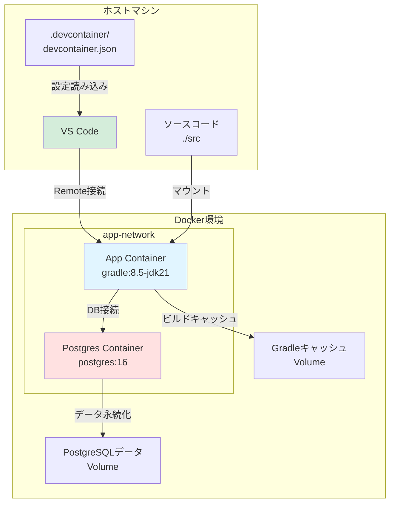

# 設計ドキュメント

## 概要

本設計は、既存のSpring Boot + Thymeleafアプリケーションに対して、Visual Studio CodeのDevContainer機能を統合するためのものです。既存のDocker環境（docker-compose.yml、Dockerfile.dev）を活用しながら、VS Code特有の設定を追加することで、開発者がコンテナ内でシームレスに開発できる環境を提供します。

### 設計目標

1. **既存環境との互換性**: 既存のDocker環境を変更せず、DevContainer設定を追加する
2. **開発者体験の向上**: VS Code内で完結する開発環境を提供する
3. **ホットリロードの維持**: 既存のSpring Boot DevToolsによるホットリロード機能を保持する
4. **簡単なセットアップ**: 最小限の手順でDevContainer環境を起動できるようにする

## アーキテクチャ

### システム構成



### レイヤー構造

1. **VS Code層**: DevContainer拡張機能、エディタ、デバッガー
2. **コンテナ層**: アプリケーションコンテナ、データベースコンテナ
3. **ボリューム層**: Gradleキャッシュ、PostgreSQLデータの永続化
4. **ネットワーク層**: コンテナ間通信用のDockerネットワーク

## コンポーネントとインターフェース

### 1. DevContainer設定ファイル (.devcontainer/devcontainer.json)

**責務**: VS CodeのDevContainer環境の設定を定義する

**主要設定項目**:
- `name`: DevContainer環境の表示名
- `dockerComposeFile`: 使用するdocker-composeファイルのパス
- `service`: docker-composeで定義されたサービス名
- `workspaceFolder`: コンテナ内の作業ディレクトリ
- `customizations.vscode.extensions`: 自動インストールする拡張機能のリスト
- `customizations.vscode.settings`: VS Codeの設定
- `forwardPorts`: ホストに転送するポート番号のリスト
- `postCreateCommand`: コンテナ作成後に実行するコマンド
- `remoteUser`: コンテナ内で使用するユーザー名

**インターフェース**:
```json
{
  "name": "Spring Boot DevContainer",
  "dockerComposeFile": "../docker-compose.yml",
  "service": "app",
  "workspaceFolder": "/app",
  "customizations": {
    "vscode": {
      "extensions": [...],
      "settings": {...}
    }
  },
  "forwardPorts": [8080, 35729, 5432],
  "postCreateCommand": "gradle dependencies --no-daemon",
  "remoteUser": "gradle"
}
```

### 2. Docker Compose統合

**責務**: 既存のdocker-compose.ymlを使用してマルチコンテナ環境を起動する

**既存設定の活用**:
- `app`サービス: アプリケーションコンテナ（DevContainerのメインコンテナ）
- `postgres`サービス: データベースコンテナ（依存サービス）
- `volumes`: Gradleキャッシュ、PostgreSQLデータの永続化
- `networks`: コンテナ間通信用ネットワーク

**変更不要な理由**:
既存のdocker-compose.ymlは、DevContainerの要件を既に満たしているため、変更する必要がありません。DevContainer設定で`dockerComposeFile`と`service`を指定するだけで、既存の設定を活用できます。

### 3. VS Code拡張機能

**責務**: コンテナ内でJava/Spring Boot開発に必要なツールを提供する

**必須拡張機能**:
1. **Java開発**:
   - `vscjava.vscode-java-pack`: Java開発の基本パック
   - `vscjava.vscode-java-debug`: Javaデバッガー
   - `vscjava.vscode-java-test`: Javaテストランナー
   - `vscjava.vscode-maven`: Maven/Gradle統合
   - `vscjava.vscode-gradle`: Gradle統合

2. **Spring Boot開発**:
   - `vmware.vscode-spring-boot`: Spring Boot拡張機能
   - `vscjava.vscode-spring-initializr`: Spring Initializr統合
   - `vscjava.vscode-spring-boot-dashboard`: Spring Bootダッシュボード

3. **フロントエンド開発（Thymeleaf/HTML/JavaScript）**:
   - `ecmel.vscode-html-css`: HTML/CSS統合
   - `dbaeumer.vscode-eslint`: ESLint（JavaScript静的解析）
   - `esbenp.prettier-vscode`: Prettier（コードフォーマッター）
   - `formulahendry.auto-rename-tag`: HTMLタグの自動リネーム
   - `zignd.html-css-class-completion`: CSSクラス名の自動補完
   - `xabikos.JavaScriptSnippets`: JavaScript (ES6) コードスニペット

4. **開発者体験向上**:
   - `streetsidesoftware.code-spell-checker`: コードスペルチェッカー
   - `usernamehw.errorlens`: Error Lens（エラー表示の強化）
   - `christian-kohler.path-intellisense`: パスの自動補完

5. **Docker/コンテナ**:
   - `ms-azuretools.vscode-docker`: Docker統合

6. **コード品質**:
   - `sonarsource.sonarlint-vscode`: SonarLint（静的解析）
   - `shengchen.vscode-checkstyle`: CheckStyle統合

### 4. ホットリロード機能

**責務**: ソースコード変更時に自動的にアプリケーションを再起動する

**実装方法**:
既存のSpring Boot DevToolsとdocker-compose.ymlのボリュームマウント設定を活用します。

**動作フロー**:
1. 開発者がVS Code内でソースコードを編集
2. 変更がホストの`./src`ディレクトリに保存される
3. ボリュームマウントにより、コンテナ内の`/app/src`に即座に反映される
4. Spring Boot DevToolsが変更を検知
5. アプリケーションが自動的に再起動される
6. LiveReload（ポート35729）がブラウザに通知
7. ブラウザが自動的にリフレッシュされる

### 5. データベース接続

**責務**: アプリケーションコンテナからPostgreSQLコンテナへの接続を提供する

**接続設定**:
- ホスト名: `postgres`（Docker Composeのサービス名）
- ポート: `5432`
- データベース名: `appdb`
- ユーザー名: `appuser`
- パスワード: `devpassword`（環境変数`DB_PASSWORD`から取得）

**ヘルスチェック**:
既存のdocker-compose.ymlで定義されたヘルスチェック設定により、PostgreSQLが完全に起動するまでアプリケーションコンテナの起動を待機します。

### 6. 初期化スクリプト

**責務**: コンテナ作成後に必要な初期化処理を実行する

**postCreateCommandの役割**:
```bash
gradle dependencies --no-daemon
```

このコマンドは、コンテナ作成後に一度だけ実行され、Gradle依存関係を事前にダウンロードします。これにより、初回のビルド時間を短縮できます。

### 7. Git/SSH統合

**責務**: ホストのGit設定とSSH認証情報をコンテナに引き継ぐ

**VS Code DevContainerの自動機能**:
VS CodeのDevContainer拡張機能は、デフォルトで以下を自動的に処理します：
- ホストの`.gitconfig`をコンテナに共有
- SSH認証エージェントの転送
- Git認証情報ヘルパーの設定

追加の設定は不要です。

## データモデル

### DevContainer設定構造

```typescript
interface DevContainerConfig {
  // 基本設定
  name: string;                    // DevContainer環境の表示名
  dockerComposeFile: string;       // docker-composeファイルのパス
  service: string;                 // 使用するサービス名
  workspaceFolder: string;         // コンテナ内の作業ディレクトリ
  
  // VS Code設定
  customizations: {
    vscode: {
      extensions: string[];        // 自動インストールする拡張機能
      settings: Record<string, any>; // VS Code設定
    }
  };
  
  // ネットワーク設定
  forwardPorts: number[];          // ホストに転送するポート
  
  // ライフサイクルコマンド
  postCreateCommand?: string;      // コンテナ作成後のコマンド
  postStartCommand?: string;       // コンテナ起動後のコマンド
  postAttachCommand?: string;      // アタッチ後のコマンド
  
  // ユーザー設定
  remoteUser: string;              // コンテナ内のユーザー名
}
```

### ファイル構造

```
プロジェクトルート/
├── .devcontainer/
│   ├── devcontainer.json        # DevContainer設定ファイル
│   └── README.md                # DevContainerガイド
├── docker-compose.yml           # 既存のDocker Compose設定（変更なし）
├── Dockerfile.dev               # 既存の開発用Dockerfile（変更なし）
├── src/                         # ソースコード（ボリュームマウント）
└── DOCKER_GUIDE.md              # 既存のDockerガイド（補完）
```


## 正確性プロパティ

プロパティとは、システムの全ての有効な実行において真であるべき特性や動作のことです。プロパティは、人間が読める仕様と機械で検証可能な正確性保証の橋渡しとなります。

本セクションでは、DevContainer設定の正確性を検証するためのプロパティを定義します。これらのプロパティは主に設定ファイルの構造検証に焦点を当てており、実際の統合テストではなく、設定の完全性と整合性を保証します。

### プロパティ1: DevContainer設定ファイルの完全性

*任意の* devcontainer.jsonファイルについて、以下の全ての必須フィールドが存在し、正しい値を持つべきです：
- `name`: 空でない文字列
- `dockerComposeFile`: 既存のdocker-compose.ymlへの相対パス
- `service`: "app"（docker-compose.ymlで定義されたサービス名）
- `workspaceFolder`: "/app"
- `customizations.vscode.extensions`: 空でない配列
- `forwardPorts`: [8080, 35729, 5432]を含む配列
- `postCreateCommand`: Gradle依存関係ダウンロードコマンドを含む文字列
- `remoteUser`: "gradle"

**検証要件: 1.2, 1.3, 1.4, 2.2, 3.3, 6.1**

### プロパティ2: VS Code拡張機能の完全性

*任意の* devcontainer.jsonファイルについて、`customizations.vscode.extensions`配列は以下の全てのカテゴリの拡張機能を含むべきです：
- Java開発: `vscjava.vscode-java-pack`, `vscjava.vscode-java-debug`, `vscjava.vscode-java-test`, `vscjava.vscode-maven`, `vscjava.vscode-gradle`
- Spring Boot開発: `vmware.vscode-spring-boot`, `vscjava.vscode-spring-initializr`, `vscjava.vscode-spring-boot-dashboard`
- フロントエンド開発: `ecmel.vscode-html-css`, `dbaeumer.vscode-eslint`, `esbenp.prettier-vscode`, `formulahendry.auto-rename-tag`, `zignd.html-css-class-completion`, `xabikos.JavaScriptSnippets`
- 開発者体験向上: `streetsidesoftware.code-spell-checker`, `usernamehw.errorlens`, `christian-kohler.path-intellisense`
- Docker: `ms-azuretools.vscode-docker`
- コード品質: `sonarsource.sonarlint-vscode`, `shengchen.vscode-checkstyle`

**検証要件: 4.1, 4.2, 4.3**

### プロパティ3: Docker Compose設定の整合性

*任意の* docker-compose.ymlファイルについて、`app`サービスは以下の全ての設定を含むべきです：
- `build.dockerfile`: "Dockerfile.dev"を参照
- `ports`: 8080:8080と35729:35729のマッピングを含む
- `environment`: SPRING_PROFILES_ACTIVEとDB_PASSWORDを含む
- `volumes`: ./src:/app/srcマッピングとgradle-cacheボリュームを含む
- `depends_on`: postgresサービスへの依存を含む
- `networks`: app-networkへの接続を含む

**検証要件: 2.1, 2.3, 3.1**

### プロパティ4: PostgreSQL設定の完全性

*任意の* docker-compose.ymlファイルについて、`postgres`サービスは以下の全ての設定を含むべきです：
- `image`: "postgres:16"
- `environment`: POSTGRES_DB, POSTGRES_USER, POSTGRES_PASSWORDを含む
- `ports`: 5432:5432のマッピング
- `volumes`: postgres-dataボリュームと./docker/init.sql初期化スクリプトを含む
- `networks`: app-networkへの接続
- `healthcheck`: pg_isreadyコマンドを使用したヘルスチェック

**検証要件: 5.1, 5.3, 5.4, 5.5**

### プロパティ5: .gitignore設定の完全性

*任意の* .gitignoreファイルについて、以下の全てのDevContainer関連パターンを含むべきです：
- `.devcontainer/` または `.vscode/`（既に存在する場合）
- DevContainer固有の一時ファイルパターン

**検証要件: 8.2**

### プロパティ6: ドキュメントの完全性

*任意の* DevContainerドキュメント（.devcontainer/README.md）について、以下の全てのセクションを含むべきです：
- セットアップ手順
- 必要なVS Code拡張機能のリスト
- トラブルシューティングガイド
- 既存のDocker環境との違いの説明
- よくある質問（FAQ）セクション

**検証要件: 7.1, 7.2, 7.3, 7.4, 7.5, 8.5**

## エラーハンドリング

### 設定ファイルエラー

**エラーケース1: devcontainer.jsonが不正な形式**
- 検出: JSONパースエラー
- 対応: 明確なエラーメッセージを表示し、JSONの構文エラー箇所を指摘

**エラーケース2: 必須フィールドの欠落**
- 検出: プロパティ検証時に必須フィールドが存在しない
- 対応: 欠落しているフィールド名と期待される値の例を表示

**エラーケース3: docker-compose.ymlへの参照が無効**
- 検出: `dockerComposeFile`で指定されたパスにファイルが存在しない
- 対応: 正しいパスを提案（例: "../docker-compose.yml"）

### Docker環境エラー

**エラーケース4: Dockerデーモンが起動していない**
- 検出: VS CodeがDevContainerを起動しようとした際のDocker接続エラー
- 対応: Dockerデスクトップの起動を促すメッセージを表示

**エラーケース5: ポートが既に使用されている**
- 検出: コンテナ起動時のポートバインディングエラー
- 対応: 使用中のポート番号と、既存のコンテナを停止する方法を表示

**エラーケース6: ボリュームマウントの権限エラー**
- 検出: ファイルシステムアクセスエラー
- 対応: Dockerのファイル共有設定を確認するよう促す

### 拡張機能エラー

**エラーケース7: 拡張機能のインストール失敗**
- 検出: VS Codeの拡張機能インストールエラー
- 対応: 手動インストール手順を表示し、拡張機能IDを提供

## テスト戦略

### デュアルテストアプローチ

本プロジェクトでは、以下の2つの補完的なテストアプローチを採用します：

1. **ユニットテスト**: 特定の例、エッジケース、エラー条件を検証
2. **プロパティベーステスト**: 全ての入力に対する普遍的なプロパティを検証

両方のアプローチを組み合わせることで、包括的なカバレッジを実現します。ユニットテストは具体的なバグを捕捉し、プロパティテストは一般的な正確性を検証します。

### テスト実装方針

**設定ファイル検証テスト**:

本プロジェクトでは、設定ファイル（JSON、YAML）の構造検証が主なテスト対象です。以下のアプローチを採用します：

1. **スキーマ検証ライブラリの使用**:
   - JSON: JSON Schemaを使用した検証
   - YAML: YAMLパーサーとスキーマ検証ライブラリを使用

2. **テストフレームワーク**:
   - JUnit 5を使用したユニットテスト
   - AssertJを使用した流暢なアサーション

3. **テストデータ**:
   - 正常系: 完全な設定ファイルの例
   - 異常系: 必須フィールドが欠落した設定ファイルの例
   - エッジケース: 最小限の設定、最大限の設定

### ユニットテストの焦点

ユニットテストは以下に焦点を当てます：

1. **具体的な例**:
   - 正しいdevcontainer.jsonの例
   - 正しいdocker-compose.yml設定の例
   - 正しい.gitignoreパターンの例

2. **エッジケース**:
   - 空の配列や空の文字列
   - 最小限の設定
   - 追加のオプション設定を含む場合

3. **エラー条件**:
   - 必須フィールドの欠落
   - 不正な値の型
   - 存在しないファイルへの参照

### プロパティベーステストの設定

プロパティベーステストには、Javaの**jqwik**ライブラリを使用します。

**設定要件**:
- 各プロパティテストは最低100回の反復を実行
- 各テストには設計ドキュメントのプロパティを参照するタグを付与
- タグ形式: `@Tag("Feature: vscode-devcontainer-support, Property {番号}: {プロパティテキスト}")`

**プロパティテストの例**:

```java
@Property
@Tag("Feature: vscode-devcontainer-support, Property 1: DevContainer設定ファイルの完全性")
void devcontainerConfigShouldContainAllRequiredFields(@ForAll("validDevContainerConfigs") DevContainerConfig config) {
    // 全ての必須フィールドが存在することを検証
    assertThat(config.getName()).isNotEmpty();
    assertThat(config.getDockerComposeFile()).isEqualTo("../docker-compose.yml");
    assertThat(config.getService()).isEqualTo("app");
    assertThat(config.getWorkspaceFolder()).isEqualTo("/app");
    assertThat(config.getForwardPorts()).contains(8080, 35729, 5432);
    assertThat(config.getRemoteUser()).isEqualTo("gradle");
}
```

### テストカバレッジ目標

- 設定ファイル検証コード: 90%以上のラインカバレッジ
- 全てのプロパティ: プロパティベーステストで検証
- 全てのエラーケース: ユニットテストで検証

### 統合テストの範囲外

以下は統合テストの範囲であり、本設計では扱いません：

- 実際のDockerコンテナの起動と動作
- VS Codeの実際の動作
- Spring Bootアプリケーションの実行
- データベース接続の確立
- ホットリロード機能の動作

これらは、DevContainer環境を実際に起動して手動で確認する必要があります。
