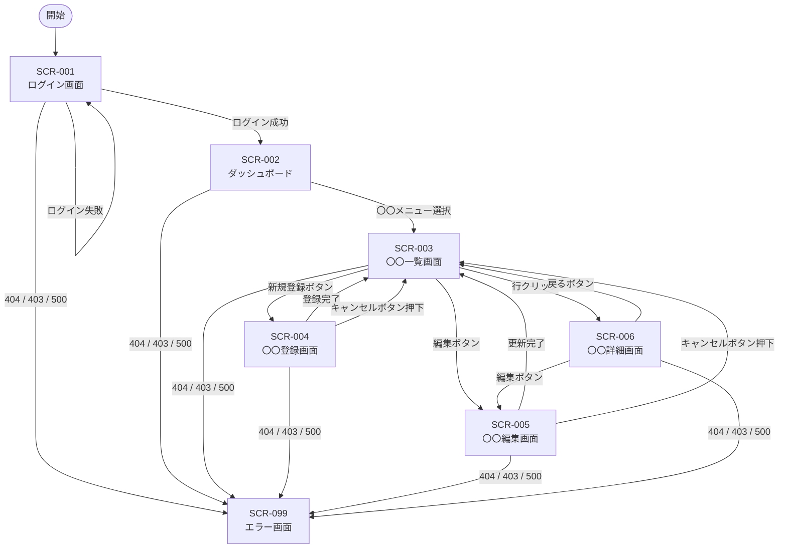

# 画面遷移設計書（一般ユーザー）

---

## 基本情報

| 項目 | 内容 |
|------|------|
| ドキュメントID | DOC-TRANSITION-GENERAL |
| 対象ロール | 一般ユーザー（ROLE-001） |
| 作成日 | YYYY-MM-DD |
| 最終更新日 | YYYY-MM-DD |
| バージョン | 1.0 |

---

## 関連ドキュメント

| ドキュメント | リンク |
|------------|--------|
| 画面一覧 | [screen-list.md](./screen-list.md) |
| 認証・認可ルール | [screen-transition-auth.md](./screen-transition-auth.md) |

---

## 1. 画面遷移図

> ⚠️ Mermaid記法に対応したMarkdownビューア（GitHub, VS Code拡張など）で図が表示されます。

---

## 2. 画面遷移一覧

| 遷移元画面ID | 遷移元画面名 | 遷移先画面ID | 遷移先画面名 | トリガー | 条件 |
|------------|-----------|------------|-----------|---------|------|
| - | (未ログイン時) | SCR-001 | ログイン画面 | 認証保護ページへのアクセス | 未認証 |
| SCR-001 | ログイン画面 | SCR-002 | ダッシュボード | ログインボタン押下 | 認証成功 |
| SCR-001 | ログイン画面 | SCR-001 | ログイン画面 | ログインボタン押下 | 認証失敗 |
| SCR-002 | ダッシュボード | SCR-003 | 〇〇一覧画面 | メニュー選択 | - |
| SCR-003 | 〇〇一覧画面 | SCR-004 | 〇〇登録画面 | 新規登録ボタン押下 | - |
| SCR-003 | 〇〇一覧画面 | SCR-005 | 〇〇編集画面 | 編集ボタン押下 | - |
| SCR-003 | 〇〇一覧画面 | SCR-006 | 〇〇詳細画面 | 行クリック | - |
| SCR-004 | 〇〇登録画面 | SCR-003 | 〇〇一覧画面 | 登録完了 | - |
| SCR-004 | 〇〇登録画面 | SCR-003 | 〇〇一覧画面 | キャンセルボタン押下 | - |
| SCR-005 | 〇〇編集画面 | SCR-003 | 〇〇一覧画面 | 更新完了 | - |
| SCR-005 | 〇〇編集画面 | SCR-003 | 〇〇一覧画面 | キャンセルボタン押下 | - |
| SCR-006 | 〇〇詳細画面 | SCR-005 | 〇〇編集画面 | 編集ボタン押下 | - |
| SCR-006 | 〇〇詳細画面 | SCR-003 | 〇〇一覧画面 | 戻るボタン押下 | - |
| 全画面 | - | SCR-099 | エラー画面 | 該当ページが存在しない | 404 Not Found |
| 全画面 | - | SCR-099 | エラー画面 | 権限不足 | 403 Forbidden |
| 全画面 | - | SCR-099 | エラー画面 | サーバーエラー発生 | 500 Internal Server Error |

---

## 改訂履歴

| バージョン | 日付 | 変更内容 |
|-----------|------|---------|
| 1.0 | YYYY-MM-DD | 初版作成 |